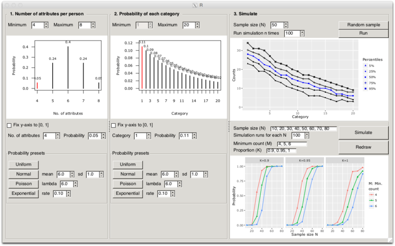
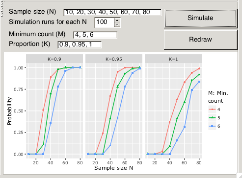
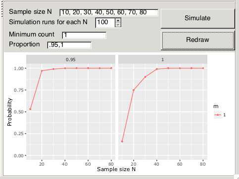

```{r, echo = FALSE, message = FALSE}
knitr::opts_chunk$set(
  comment = "#>",
  error = FALSE,
  tidy = FALSE,
  fig.width = 5, 
  fig.height = 5,
  fig.align = "center"
)
```


## Purpose

When conducting multiple repertory grid interviews a common analysis strategy is to sort the constructs in semantically similar categories by means of inductive content analysis [@green_personal_2004; @jankowicz_easy_2004]. Depending on the specific study, different goals may be relevant. The researcher may want to:

1. identify all categories that are relevant to the field of study and/or 
2. collect a sufficiently large number of constructs per category. 

A common approach to achieve this is to conduct additional interviews until 1) and/or 2) are accomplished. However, when planning a repertory grid study, this is not satisfactory as the number of interviews to be conducted is not known a priori. As a remedy, a rule of thumb may be used. It has been documented that category saturation occurs between 15 and 25 interviews [@van_de_kerkhof_repertory_2009; @napier_it_2009; @tan_repertory_2002]. However, this rule of thumb does not help to achieve goal 2).

Conducting simulations would be an appropriate way to assess the required sample size. However, for many applied researchers from the field of Personal Construct Psychology, where the repertory grid is frequently applied, this is not feasible. The `gridsampler` GUI is designed to make such types of simulations an easy task. It allows to quickly conduct simulations necessary to get a rough estimate of the study specific required sample size without the need to program the simulation. Using the software the following generic type of questions can be answered: 

> “What is the probability to get a result where at least C percent of the categories contain a minimum of M attributes when using the sample size N?”

By reviewing the corresponding probabilities calculated by means of simulation (see below), an appropriate sample size can be determined.

## Install and load

To install the software from CRAN (recommended), use the following command:

```{r eval=FALSE}
install.packages("gridsampler") 
```

If you prefer to install from GitHub, use the `devtools` package.

```{r eval=FALSE}
library(devtools)
install_github("gridsampler/markheckmann") 
```

To load and start the GUI type

```{r eval=FALSE}
library(gridsampler)
gridsampler()
```

## Program features

The GUI displayed in the image below consists of a single display made up of three panels. In panel 1 and 2, the parameters for the specific study are set. In panel 3, the simulations are prompted and its results are displayed. In the following, the panels are explained.



1. **Number of attributes per person**

The number of constructs elicited usually varies across persons (unless fixed by design). Depending on the field of study and context, a specific distribution of constructs can be assumed. For example, we may know from prior research, that for a study on car brands, individuals typically express between 4 and 8 constructs, with most individuals using 6 constructs. The particular expected distribution of elicited constructs across persons can be specified in panel 1. On the bottom of the panel, several presets for distribution are available. In most cases, a normal-like distribution will be suitable.

2. **Probability of each category**

In this panel, the expected number of categories can be defined. The number of categories may vary across fields of research. In some fields, for example interpersonal relations, subjects tend to possess more constructs than for fields they have less experience with, for example when in comes to describing different [types of snow](https://en.wikipedia.org/wiki/Types_of_snow). Each category is associated with a specific probability of being elicited. When the results for a single person are simulated, the attributes are drawn from this distribution without replacement, as the grid protocol assumes that identical constructs are not elicited twice in the same interview.

3. **Simulate sample**

The rightmost panel is split into an upper and a lower part. 

*Upper part*: In the upper part, a simulation can be prompted for a given sample size (number of subjects) by pressing "One Random Sample of Size N". By pressing the button "R Random Samples of Size N" samples are repeatedly generated and the distribution of the results per category are indicated using selected percentiles. From the image, it can be inferred that the median number of occurrences of category 1 was 29, the 5th percentile at 23 and the 95th at 36. This gives the user a rough idea about the category counts to be expected.

*Lower part*: In the lower part of panel 3, this simulation is conducted for different samples sizes. The following parameters can be set:

* The sample sizes N to simulate
* Number of simulations for each run

The simulation is prompted by pressing "Simulate R Samples for Each N". Right below the simulation parameters the drawing parameters can be defined. These are independent of the simulation itself and only determine which values are displayed. To redraw the graphic with different parameters press the "Redraw with New Settings" button.

* Minimum count: the minimal number of construct per category to occur
* Coverage: the proportion of categories that fulfill the minimal count

All parameters can either be given as numeric values separated by commas or using the colon operator from *R*, i.e. `1:3` for `1, 2, 3`. Additionally, it is also possible to use the `seq()` function in the input field, e.g. `seq(20, 80, by = 5)`. 

## Interpretation of results

The following image shows an enlargement of the lower part of panel 3.



The graphic contains three facets, with one facet for each requested proportion value. In each facet, the x-axis shows the simulated sample sizes N and the y-axis the probability of getting the specific result. For each value M, i.e. the minimal number of constructs contained in a category, a separate line is drawn, as indicated in the legend on the right. To answer the question 

> “What is the probability to get a result where at least C=95% percent of the categories contain a minimum of M=5 attributes when using the sample size 50?”

The value can be read off from the facet in the middle (C=95%) and is approximately $.8$. Given this information the researcher can decide if it is acceptable to have a few categories with less than 4 constructs. Alternatively, the sample size can be adjusted.

As a second example, we may choose another common study goal. Often a researcher wants to discover all existing categories, i.e. to sample at least one construct from each category. 

> “What is minimum sample size required, to get a result where C=100% percent of the categories contain a minimum of M=1 attributes (i.e. are recovered) with a probability of almost 100%?”

It is not necessary to rerun the simulation but simply change the drawing parameters. To request a suitable graphic to evaluate this question we can set the minimum count to $M=1$ and use a proportion of $C=`.95, 1`$. The result is displayed in the figure below. It can be seen that the probability to sample a construct from every category when using $N=40$ is close to $1$. With $N=20$ we can still be confident to recover all categories with a probability of $.75$. This is somewhat different from the rule of thumb of $N \in [15; 25]$ to recover all categories given in the literature [@van_de_kerkhof_repertory_2009; @napier_it_2009; @tan_repertory_2002] and shows that study specific simulations may be useful.



## User Feedback

You can report bugs and suggest new features or enhancements on the [github issue site](https://github.com/markheckmann/gridsampler/issues).

## References

