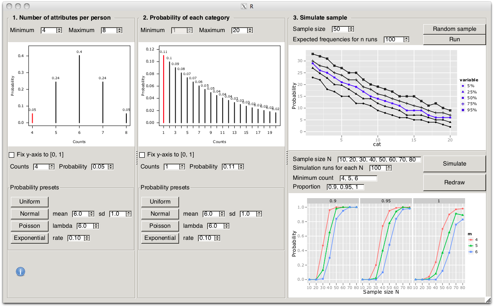

```{r, echo = FALSE, message = FALSE}
knitr::opts_chunk$set(
  comment = "#>",
  error = FALSE,
  tidy = FALSE,
  fig.width=5, 
  fig.height=5,
  fig.align = "center"
)
```

## Intro

```{r setup, warning=FALSE, message=FALSE}
library(gridsampler)
```



